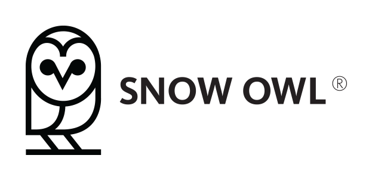

# 

Snow Owl&reg; is a highly scalable, open source terminology server with revision-control capabilities and collaborative authoring platform features. It allows you to store, search and author high volumes of terminology artifacts quickly and efficiently. 

Features include:
* Revision-controlled authoring
    * Maintains multiple versions (including unpublished and published) for each terminology artifact and provides APIs to access them all
    * Independent work branches offer work-in-process isolation, external business workflow integration and team collaboration
* SNOMED CT and others
    * Full SNOMED CT terminology support and APIs (full RF2 support, ECL v1.3, Reference Sets, OWL 2 EL/DL support)
    * With its modular design, the server can maintain multiple terminologies (including local codes, mapping sets, value sets)
* Various set of APIs
    * HTTP RESTful API
    * FHIR API
    * Native Java API
* Highly extensible and configurable
    * Simple to use plug-in system makes it easy to develop and add new terminology tooling/API or any other functionality
* Built on top of [Elasticsearch](https://www.elastic.co/products/elasticsearch) (highly scalable, distributed, open source search engine)
    * Connect to your existing cluster or use the embedded instance
    * All the power of Elasticsearch is available (full-text search support, monitoring, analytics and many more) 

## Requirements

You need to have a recent version of Java installed (Java 8 update 171 or newer).

## Installation

* Download and unzip the official Snow Owl distribution from the [Releases](https://github.com/b2ihealthcare/snow-owl/releases) page (or use the official Docker image)
* Run `bin/startup` on unix, or `bin/startup.bat` on windows
* Run `curl http://localhost:8080/snowowl/admin/info`
* See [REST API docs](http://localhost:8080/snowowl/snomed-ct/v3), [FHIR API docs](http://localhost:8080/snowowl/fhir)

## Where to go from here?

We have just covered a very small portion of what Snow Owl is all about. For more information, please refer to the official [Snow Owl](https://b2i.gitbook.io/snow-owl/) website.

# Building from source

Snow Owl uses Maven for its build system. In order to create a distribution, simply run the following command in the cloned directory. 

    mvn clean package

The distribution package can be found in the `releng/distribution/target` folder, when the build is complete.

To run the test cases, use the following command:

    mvn clean verify

# Development

These instructions will get Snow Owl up and running on your local machine for development and testing purposes.

## Prerequisites

Snow Owl is an Equinox-OSGi based server (using either Virgo or standalone OSGi). To develop plug-ins for Snow Owl you need to use Eclipse as IDE: 
* Use latest Eclipse IDE for Eclipse Committers package: http://www.eclipse.org/downloads/eclipse-packages/

Required Eclipse plug-ins (install the listed features via `Help` -> `Install New Software...`):

*Note: you may have to untick the `Show only the latest versions of the available software` checkbox to get older versions of a feature. Please use the exact version specified below, not the latest point release.*

* Xtext/Xtend (http://download.eclipse.org/modeling/tmf/xtext/updates/composite/releases/)
  * MWE 2 language SDK 2.9.0 (MWE)
  * Xtend IDE 2.11.0 (Xtext)
  * Xtext Complete SDK 2.11.0 (Xtext)
* Optional: Maven integration (http://download.eclipse.org/technology/m2e/releases) 
 
### Eclipse Preferences

Make sure you have the following preferences enabled/disabled.
* Plug-in development API baseline errors is set to Ignored (Preferences > Plug-in Development > API Baselines)
* The *Plugin execution not covered by lifecycle configuration: org.apache.maven.plugins:maven-clean-plugin:2.5:clean* type of errors can be ignored or changed to *Warnings* in *Preferences->Maven->Errors/Warnings*.
* Set the workspace encoding to *UTF-8* (Preferences->General->Workspace)
* Set the line endings to *Unix* style (Preferences->General->Workspace)

### Git configuration

* Make sure the Git line endings are set to *input* (Preferences->Team->Git->Configuration - add key if missing *core.autocrlf = input*)

## First steps

1. Import all projects into your Eclipse workspace and wait for the build to complete
2. Open the `target-platform/target-platform-local.target` file
3. Wait until Eclipse resolves the target platform and then click on `Set as Target platform`
4. Wait until the build is complete and you have no compile errors
5. Launch `snow-owl-community` launch configuration in the Run Configurations menu
6. Navigate to `http://localhost:8080/snowowl/snomed-ct/v3`

# Contributing

Please see [CONTRIBUTING.md](CONTRIBUTING.md) for details.

# Versioning

Our [releases](https://github.com/b2ihealthcare/snow-owl/releases) use [semantic versioning](http://semver.org). You can find a chronologically ordered list of notable changes in [CHANGELOG.md](CHANGELOG.md).

# License

This project is licensed under the Apache 2.0 License. See [LICENSE](LICENSE) for details and refer to [NOTICE](NOTICE) for additional licensing notes and uses of third-party components.
