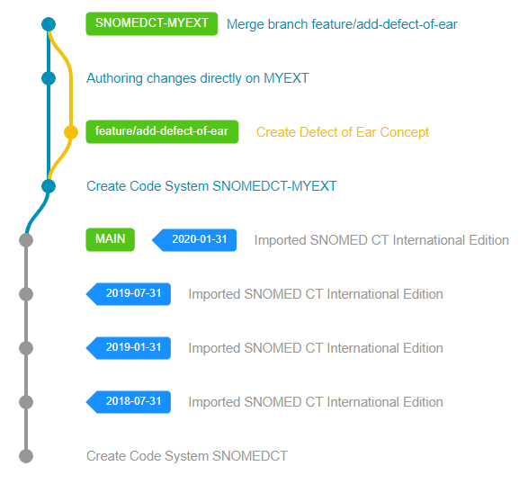

# SNOMED CT and Extension Development

Authoring is the process by which content is created in an extension in accordance with a set of authoring principles. These principles ensure the quality of content and referential integrity between content in the extension and content in the International Edition (the principles are set by SNOMED International, can be found [here](https://confluence.ihtsdotools.org/display/DOCEXTPG/5.4+Authoring)).

During the extension development process authors are:
* creating, modifying or inactivating content according to editorial principles and policies
* running validation processes to verify the quality and integrity of their Extension
* classifying their authored content with an OWL Reasoner to produce its distribution normal form

The authors directly (via the available REST and FHIR APIs) or indirectly (via user interfaces, scripts, etc.) work with the Snow Owl Terminology Server to make the necessary changes for the next planned Extension release.

## Workflow and Editing

Authors often require a dedicated editing environment where they can make the necessary changes and let others review the changes they have made, so errors and issues can be corrected before integrating the change with the rest of the Extension.
Similarly to how SNOMED CT Extensions are separated from the SNOMED CT International Edition and other dependencies, this can be achieved by using branches.

* [Branching API](../api/snomed/branching.md) - to create and merge branches
* [Compare API](../api/snomed/compare.md) - to compare branches

## Authoring APIs

To let authors make the necessary changes they need, Snow Owl offers the following SNOMED CT component endpoints to work with:

* [Concept API](../api/snomed/concepts.md) - to create, edit SNOMED CT Concepts
* [Description API](../api/snomed/descriptions.md) - to create, edit SNOMED CT Descriptions
* [Relationship API](../api/snomed/relationships.md) - to create, edit SNOMED CT Relationships
* [Reference Set API](../api/snomed/refsets.md) - to create, edit SNOMED CT Reference Sets
* [Reference Set Member API](../api/snomed/members.md) - to create, edit SNOMED CT Reference Set Members

## Validation

To verify quality and integrity of the changes they have made, authors often generate reports and make further fixes according to the received responses.
In Snow Owl, reports and rules can be represented with validation queries and scripts.

* [Validation API](../api/snomed/validation.md) - to run validation rules and fetch their reported issues on a per branch basis

## Classification

Last but not least, authors run an OWL Reasoner to classify their changes and generate the distribution normal form of their Extension.
The [Classification API](../api/snomed/classification.md) provides support for running these reasoner instances and generating the distribution normal form.
