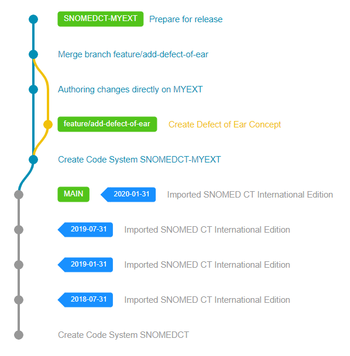
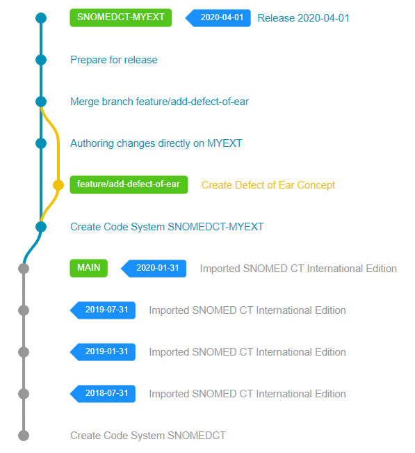

# Releases

When an Extension reaches the end of its current development cycle, it needs to be prepared for release and distribution.

## Workflows and Authoring Branches

All planned content changes that are still on their dedicated branch either need to be integrated with the main development version or removed from the scope of the next release.

## Prepare the Release

After all development branches have been merged and integrated with the main work-in-progress version, the Extension needs to be prepared for release. This usually involves last minute fixes, running quality checks and validation rules and generating the final necessary normal form of the Extension.

## Release

When all necessary steps have been performed successfully, a new Code System Version needs to be created in Snow Owl to represent the latest release. The versioning process will assign the requested `effectiveTime` to all unpublished components, update the necessary Metadata reference sets (like the Module Dependency Reference Set) and finally create a version branch to reference this release later.

## Packaging

After a successful release, an RF2 Release Package needs to be generated for downstream consumers of your Extension. Snow Owl can generate this final RF2 Release Packages for the newly released version via the [RF2 Export API](https://github.com/b2ihealthcare/snow-owl/tree/8a7fdb764156e4d99482a6868a5efcce0e6dcb0e/docs/api/snomed/export.md).
