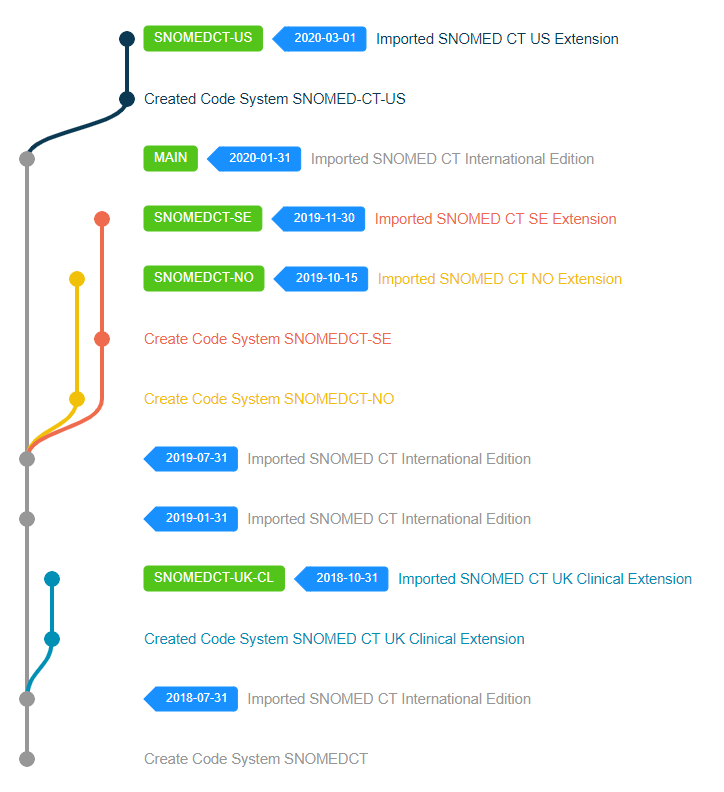

# Multi Extension Authoring and Distribution

On top of single Edition/Extension distribution and authoring, Snow Owl provides full support for multi-SNOMED CT distribution and authoring even if the Extensions depend on different versions of SNOMED CT International Edition.

To achieve a deployment like this you need to perform the same initialization steps for each desired SNOMED CT Extension as if it were a single extension scenario (see [single extension](./single-extension.md)).
Development and maintenance of each managed extension can happen in parallel without affecting one or the other. Each of them can have their own release cycles, maintenance and upgrade schedules and so on.

# Next steps

After you have initialized your Snow Owl instance with the Extensions you'd like to maintain the next steps are:

[Development](../development.md)
[Release](../release.md)
[Upgrade](../upgrade.md)
[Integrate](../integrations.md)