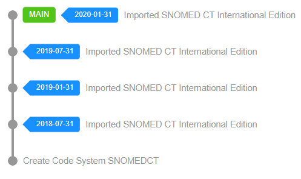
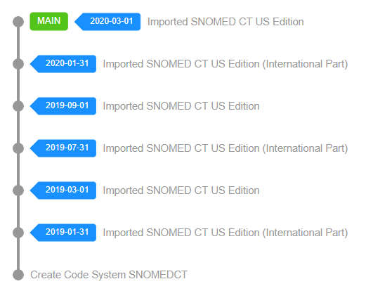

# Single Edition

The most common use case to consume a SNOMED CT Release Package is to import it directly into a Terminology Server (like Snow Owl) and make it available as read-only content for both human and machine access (via REST and FHIR APIs). 

## SNOMED CT International Edition

Since Snow Owl by default comes with a pre-initialized SNOMED CT Code System called `SNOMEDCT`, it is just a single call to import the official RF2 package using the [SNOMED CT RF2 Import API](../../api/snomed/import.md)
The import by default creates a Code System Version for each SNOMED CT Effective Date available in the supplied RF2 package.
After a successful import the content is immediately available via REST and FHIR APIs.

## SNOMED CT Extension Edition

National Release Centers and other Care Providers provide their own SNOMED CT Edition distribution for third-party consumers in RF2 format. Importing their Edition distribution instead of the International Edition directly into the `SNOMEDCT` pre-initialized SNOMED CT Code System with the same [SNOMED CT RF2 Import API](../../api/snomed/import.md) makes both the International Edition (always included in Edition packages) and the National Extension available for read-only access.

## Summary

The single edition scenario without much effort provides access to any SNOMED CT Edition directly on the pre-initialized `SNOMEDCT` Code System. It is easy to set up and maintain. 
Because of its flat structure, it is good for distribution and extension consumers. Although it can be used for authoring in certain scenarios, due to the missing distinction between the International Edition and the Extension, it is not the best choice for extension authoring and maintenance.


This scenario can be further extended to support multiple simultaneous Edition releases living on their own dedicated SNOMED CT Code Systems. The Root `SNOMEDCT` Code System in this case is empty and only serves the purpose of creating other Code Systems "underneath" it. Each SNOMED CT Code System is then imported into its own dedicated branch forming a star-like branch structure at the end (zero-length `MAIN` branch and content branches). This is useful in distribution scenarios, where multiple Extension Code Systems need to be maintained with their own dedicated set of dependencies and there is no time to set up the proper Extension Scenario (see next section). The only drawback of this setup is the potentially high usage of disk space due to the overlap between the various Editions imported into their own Code Systems (since each of them contains the entire International Release).
#

Pros:
* Good for maintaining the SNOMED CT International Edition
* Good for distribution
* Simple to set up and maintain

Cons:
* Not recommended for extension authoring and maintenance
* Not recommended for multi-extension distribution scenarios
