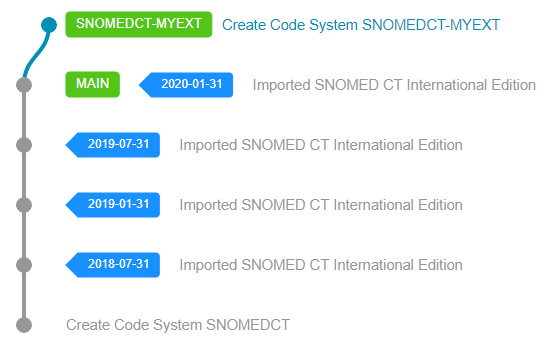
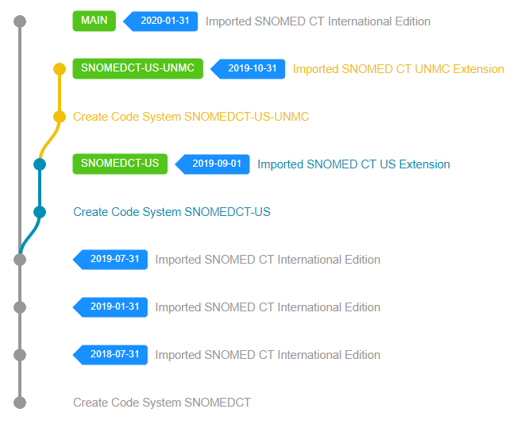

# Single Extension Authoring and Distribution

A typical extension scenario is the development of the extension itself. Whether you are starting your extension from scratch or already have a well-developed version that you need to maintain, the first choice you need to make is to identify the dependencies of your SNOMED CT Extension. 

## Extending the International Edition

If your Extension extends the SNOMED CT International Edition directly, then you need to pick one of the available International Edition versions:
* If you are starting from scratch, it is always recommended to select the latest International Release as the starting point of your Extension.
* If you have an existing Extension then you probably already know the International Release version your Extension depends on.

When you have identified the version you need to depend on then you need to import that version (or a later release packages that also includes that version in its FULL RF2 package) first into Snow Owl. Make sure that the `createVersion` feature of the RF2 import process is enabled, so it will automatically create the versions for each imported RF2 `effectiveTime` value.

After you have successfully imported all dependencies into Snow Owl, the next step is to create a Code System that represents your SNOMED CT Extension (see [Core API](../../api/admin/index.md)).
When creating the Code System, besides specifying the namespace and optional modules and languages, you need to enter a Code System `shortName`, which will serve as the unique identifier of your Extension and select the `extensionOf` value, which represents the dependency of the Code System.

After you have successfully created the Code System representing your Extension, you can import any existing content from a most recent release or start from scratch by creating the module concept of your extension.


RF2 releases tend to have content issues with the International Edition itself or refer to missing content when you try to import them into Snow Owl via the RF2 Import API. For this reason, the recommended way is to always use the most recent Snapshot RF2 release of a SNOMED CT Extension to form its first representation in Snow Owl. That has a high probability of success without any missing component dependency errors during import. If you are having trouble importing an RF2 Release Package into Snow Owl, feel free to raise a question on our [GitHub Issues](https://github.com/b2ihealthcare/snow-owl/issues/new) page.
#

## Extending another Extension

If your Extension needs to extend another Extension and not the International Edition itself, then you need to identify the version you'd like to depend on in that Extension (that indirectly will select the International Edition dependency as well). When you have identified all required versions, then starting from the International Edition recursively traverse back and repeat the RF2 Import and Code System creation steps described in the previous section until you have finally imported your extension. In the end your extension might look like this, depending on how many Extensions you are depending on. 

## Summary

Setting up a Snow Owl deployment like this is not an easy task. It requires a thorough understanding of each SNOMED CT Extension you'd like to import and their dependencies as well.
However, after the initial setup, the maintenance of your Extension becomes straightforward, thanks to the clear distinction from the International Edition and from its other dependencies.
The release process is easier and you can choose to publish your Extension as an extension only release, or as an Edition or both (see [Release](../release.md)).
Additionally, when a new version is available in one of the dependencies, you will be able to upgrade your Extension with the help of automated validation rules and upgrade processes (see [Upgrade](../upgrade.md)).
From the distribution perspective, this scenario shines when you need to maintain multiple Extensions/Editions in a single deployment.

Pros: 
* Excellent for authoring and maintenance
* Good for distribution

Cons:
* Harder to set up the initial deployment
