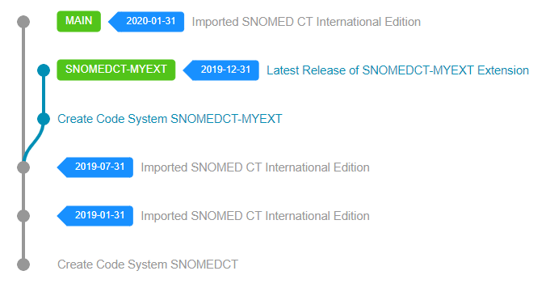
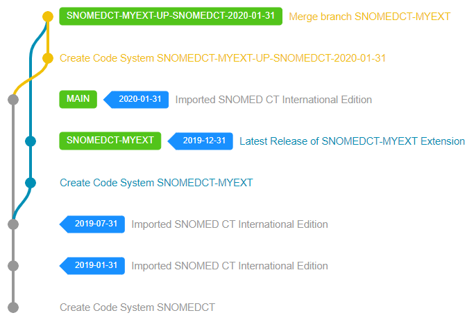
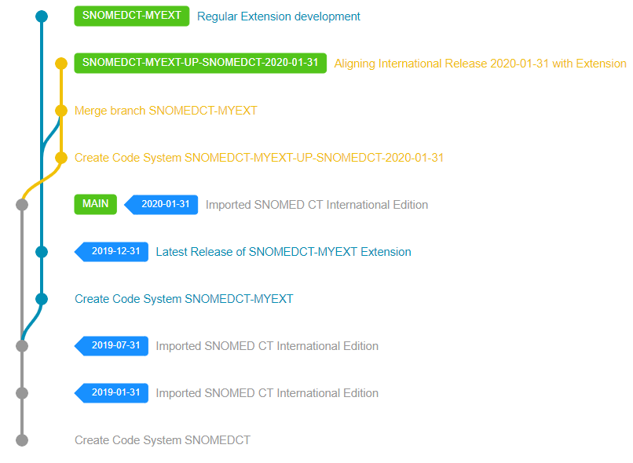
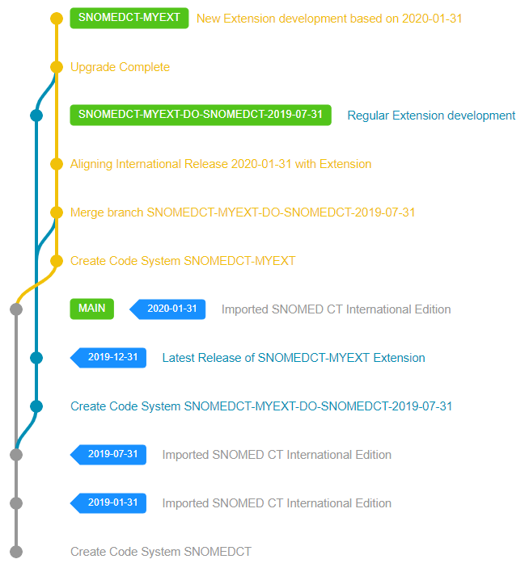

# Extension Maintenance and Upgrades

Maintenance of a SNOMED CT Extension is essential to ensure that
* it incorporates changes requested by terminology consumers
* it remains aligned with the SNOMED CT International Edition

While both of these maintenance related tasks are potentially assigned to one of the upcoming Extension development cycles, there is a clear distinction between the two maintenance tasks.


See additional Extension maintenance related material in the official [Extensions Practical Guide](https://confluence.ihtsdotools.org/display/DOCEXTPG/5.7+Maintenance).
#

## Change requests

Changes requested by your terminology consumers are basically comparable tasks that you would assign to an Extension authoring team. They are usually come with a well-described problem you need to address in the terminology as you would do in the usual development cycle. 

See the [Extension Development](./development.md) section on how you can address change requests and incorporate them as regular tasks into the main version of your Extension.

## International Edition Changes

Aligning to the SNOMED CT International Edition is one of the main responsibilities of an Extension maintainer. However, keeping up with the changes introduced in SNOMED CT International Edition biannually (on January 31st and July 31st) could be an overwhelming task, especially if:
* you are under pressure from your terminology consumers to make the requested changes sooner, especially in mission critical scenarios.
* the changes introduced in the International Edition are conflicting with your local changes and/or causing maintenance related issues after the upgrade.

To address SNOMED CT International Edition upgrade tasks in a reliable and reproducible way, Snow Owl offers an upgrade flow for SNOMED CT Extensions.

## Upgrades

A Code System upgrade in Snow Owl is a complex workflow with states and steps. The workflow involves a special Upgrade Code System, a series of automated migration processes and validation rules to ensure the quality and reliability of the operation. The upgrade can be done quickly, if there were no conflicts between the Extension and the International Edition and can be a long-running process spanning over many months.

### Starting the Upgrade

In Snow Owl, SNOMED CT Extension are linked to their SNOMED CT dependency with the `extensionOf` property. This property describes the International Edition and its version the Extension depends on. For example, `SNOMEDCT/2019-07-31` value specifies that our Extension depends on the 2019-07-31 version of the International Edition.

Extension upgrade can be started when there is a new version available in the Extension/Edition we have selected as our dependency in the `extensionOf` property. When fetching a SNOMED CT Code System via the Code System API, Snow Owl will check if there is any upgrade available and returns it back in the `availableUpdates` array property. If there are no upgrades available the array will be empty.

To start an Extension upgrade to a newer International Edition (or to a newer Extension dependency version), you can use the [Upgrade API](../api/admin/upgrade.md). The only thing that needs to be specified there is the desired new version of the Extension's `extensionOf` dependency.

When the upgrade started, Snow Owl creates a special `<codeSystemShortName>-UP-<newExtensionOf>` (eg. `SNOMEDCT-MYEXT-UP-SNOMEDCT-2020-01-31`) Code System to allow authors and the automated processes migrate current latest development version of the Extension to the new dependency.

### Regular Maintenance

Regular daily Extension development tasks are still need to be resolved and pushed somewhere in order to continue the development of the Extension, even if an upgrade process is in the progress. Each Extension has a still active development version, even if an upgrade is in progress, which can be used to push daily maintenance changes and business as usual tasks.

Changes pushed to the development area will regularly need to be synced with the upgrade until the upgrade completes, so the upgrade team will be able to resolve all remaining conflicts and issues.

### Upgrade Checks

To ensure the quality of the upgrade process and execute certain tasks/checks automatically. An Upgrade Check can be any logic or function you would run during the upgrade. Upgrade Checks can access the underlying upgrade Code System's content and report any issues (validation rules) or fix content automatically (migration rules). For example, a validation rule (like `Active relationships must have active source, type, destination references`) can be executed after each change pushed to the upgrade branch to verify whether there is any potentially invalid relationship left to fix or you are ready to go.

### Completing the Upgrade

Once the upgrade authoring team is done with the necessary changes to align the Extension with the International Edition and all the checks are completed successfully the upgrade can be completed.
Completing the upgrade performs the following steps:
* Creates a `<codeSystemShortName>-DO-<previousExtensionOf>` Code System to refer to the previous state of the Extension
* Changes the current working branch of the Extension Code System to the branch that was used during the upgrade process
* Deletes the `<codeSystemShortName>-UP-<newExtensionOf>` Code System, which marks the upgrade complete, and the upgrade itself cannot be accessed anymore.

